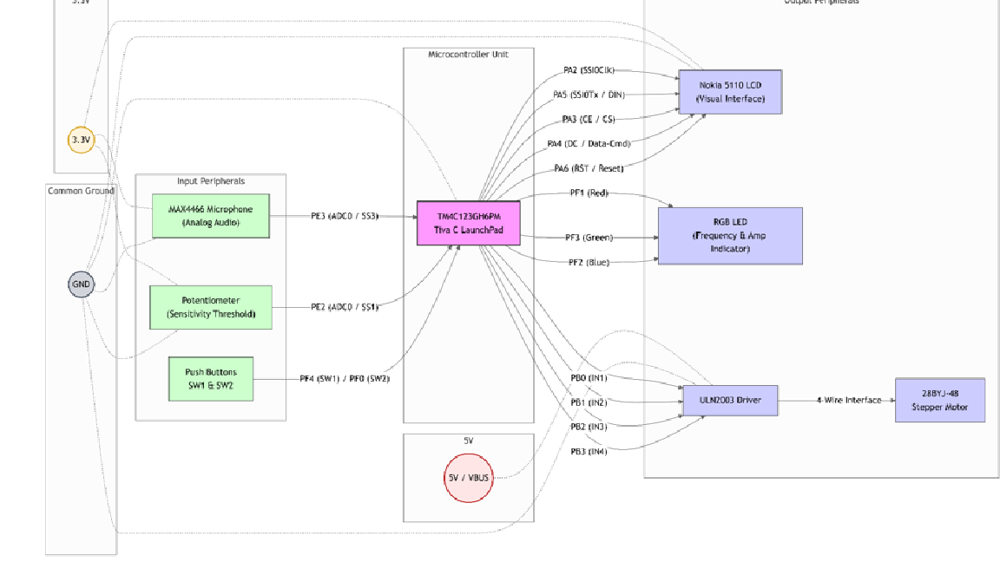

# Audio Frequency-Based Stepper Motor Driver

## Overview
This repository contains a mixed-language (ARM Assembly & C) embedded system project developed by Eşref Tufan Yiğit for the EE447 course at Middle East Technical University (ODTÜ). 

The system acts as an audio analyzer and actuator. It samples audio from a microphone, computes the dominant frequency in real-time using a 512-point Fast Fourier Transform (FFT), and drives a stepper motor at a speed proportional to that frequency. It also provides visual feedback via an RGB LED and a Nokia 5110 LCD screen.

## Key Features
* **Mixed-Language Data Acquisition:** A custom ARM Assembly routine (`adc_read.s`) strictly handles the high-speed ADC reads to ensure zero overhead, triggered by a 4000 Hz SysTick interrupt.
* **Digital Signal Processing:** Utilizes the ARM CMSIS DSP library (`arm_cfft_q15` and `arm_cmplx_mag_q15`) to perform a 512-point FFT on the Q15 fixed-point audio data.
* **Dynamic Motor Actuation:** Drives a 28BYJ-48 stepper motor via GPTM interrupts. Motor speed dynamically scales with the detected audio frequency, safely clamped to a 5ms minimum step period to prevent coil stalling.
* **Custom SPI Display Driver:** Interfaces with a Nokia 5110 LCD to display real-time frequency (Hz), amplitude, and user-configurable thresholds.
* **Amplitude-Modulated PWM:** The onboard RGB LED changes color based on frequency bands (Low=Red, Mid=Green, High=Blue) and its brightness is modulated via a software PWM implementation based on the signal's amplitude.

## Hardware Requirements
* **Microcontroller:** TM4C123GXL Tiva C Series LaunchPad
* **Microphone:** MAX4466 (with adjustable gain)
* **Display:** Nokia 5110 LCD (PCD8544 controller)
* **Actuator:** 28BYJ-48 Stepper Motor + ULN2003A Driver Board
* **Inputs:** 10kΩ Potentiometer (for amplitude threshold), On-board SW1 & SW2 buttons (for motor direction)

## Hardware Schematic & Architecture

*Block diagram illustrating the power distribution, analog/digital input peripherals, and output interfaces connected to the TM4C123GH6PM microcontroller.*

## Pin Mapping
| Component | Pin(s) | Peripheral | Description |
| :--- | :--- | :--- | :--- |
| **MAX4466 Mic** | PE3 | ADC0 SS3 | 4kHz Audio Input |
| **Potentiometer** | PE2 | ADC0 SS1 | Amplitude Threshold Input |
| **Nokia 5110 LCD** | PA2, PA5 | SSI0 (SPI) | SCLK, MOSI |
| **Nokia 5110 Ctrl**| PA3, PA4, PA6| GPIO | CE, DC, RST |
| **Stepper Motor** | PB0 - PB3 | GPIO | ULN2003A IN1-IN4 |
| **RGB LED** | PF1, PF2, PF3 | GPIO (PWM) | Red, Blue, Green |
| **Buttons** | PF0, PF4 | GPIO | SW2 (CCW), SW1 (CW) |

## Software Architecture
* `adc_read.s`: The AAPCS-compliant ARM Assembly subroutine for direct ADC FIFO extraction and 12-bit to Q15 formatting.
* `Son_integrated.c`: The main application loop, system state machine, FFT execution, and LCD rendering logic.
* `stepper.c` / `stepper.h`: Abstraction layer for the stepper motor, managing the 4-step unipolar sequence array and the 64-bit tick math for precise Timer0A reload values.

## Build Instructions (Keil µVision)
1.  Clone this repository and open the project file in Keil µVision.
2.  Ensure the **TivaWare™ for C Series** library is correctly linked in your Include Paths.
3.  Add the **CMSIS CORE and DSP** components via the *Manage Run-Time Environment* window.
4.  **CRITICAL - Compiler Optimization:** The CMSIS DSP library contains over 900 KB of functions. To fit the project into the TM4C123G's 256 KB flash memory:
    * Go to **Options for Target** -> **C/C++ Tab**.
    * Set **Optimization** to `Level 1 (-O1)`.
    * Check **"One ELF Section per Function"** so the linker can strip unused math functions.
5.  Build (F7) and Flash (F8) to the board.

## License & Disclaimer
This project was developed for academic purposes. Ensure that the stepper motor is disconnected or powered externally if running under prolonged heavy load to avoid drawing excessive current directly from the LaunchPad's 5V pin.
